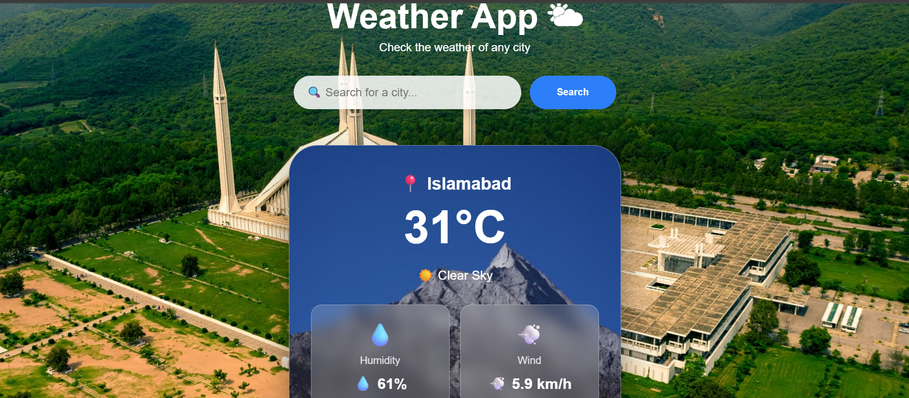

# 🌤 Weather Website | Real-Time Weather Forecast


A modern weather application built using **HTML**, **CSS**, and **JavaScript** that displays real-time weather information for any city in the world. The app also fetches beautiful city and weather-themed images to create a visually appealing experience.

## 🚀 Live Demo

👉 **Live Website:** https://weather-website-two-ivory.vercel.app/

---

## ✨ Features

- 🌍 Search weather by city name
- 🌡️ Real-time temperature
- 💧 Humidity
- 💨 Wind speed
- ☁️ Weather condition with icons
- 🏙️ Dynamic city background images
- 🌄 Weather-themed glassmorphism card background
- 🎲 Random city and weather background images on every search
- ⏳ Loading spinner while fetching data
- ❌ Error handling for invalid city names
- ✅ Input validation
- 📱 Responsive design

---

## 🛠 Technologies Used

- HTML5
- CSS3
- JavaScript (ES6)
- Open-Meteo API
- Open-Meteo Geocoding API
- Pexels API
- Git & GitHub
- Vercel

---

## 📸 Screenshots


---

## 📚 What I Learned

While building this project, I learned:

- Working with REST APIs
- Using `fetch()`
- Understanding Promises
- Using `async` / `await`
- Parsing JSON responses
- DOM manipulation
- Error handling with `try...catch`
- Form validation
- Using multiple APIs together
- Secure API handling using Vercel Serverless Functions
- Deploying applications with Vercel
- Version control using Git and GitHub

---

## 🔮 Future Improvements

- 7-day weather forecast
- Hourly weather forecast
- Geolocation support
- Dark / Light mode
- Weather charts
- Favorite cities
- Better animations

---

## ⚙️ Installation

Clone the repository

```bash
git clone https://github.com/Akbarhussain973/weather_website.git
```

Go to the project folder

```bash
cd weather_website
```

Install Vercel (only if you want to run the serverless function locally)

```bash
npm install -g vercel
```

Run the development server

```bash
vercel dev
```

---

## 🙏 Acknowledgements

- Open-Meteo for weather data
- Pexels for beautiful images
- Vercel for deployment

---

## 📄 License

This project is licensed under the MIT License.

---

## 👨‍💻 Author

**Akbar Hussain**

Software Engineering Student | Learning Full Stack Web Development

⭐ If you like this project, consider giving it a star!
